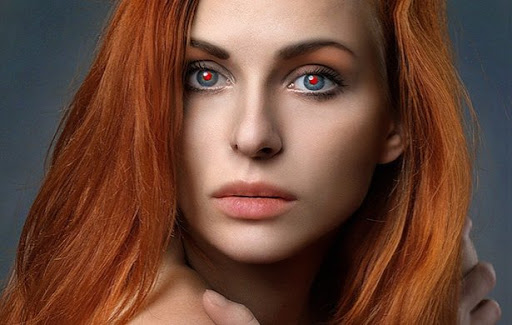
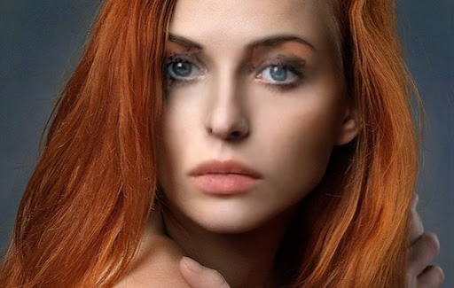

# Eyewash
Clean Photos through AI

## Project Description


With the advent of powerful cameras within smartphones, photography is becoming more commonplace. With this increased usage, more people will find themselves with an amazing picture and be disappointed due to it being ruined by unwanted blemishes.  However, current ways to remove blemishes such as redeye require manual work to apply the appropriate effect.

Example of using a current app to remove redeye blemish:

 

Eyewash is a package to automatically remove blemishes from portrait photos. Users no long have to manually select pixels as well as create more realistic fixes to the blemishes rather than filling in with a specific color.  The implementation uses OpenCV HAAR cascades to detect redeye and remove the affected pixels through image infilling with Deep Convolutional Generative Adversarial Networks (DCGANs).   

### Sample Results

__Before__ &emsp; &emsp; &emsp; &emsp; &emsp; &emsp; &emsp; &emsp; &emsp;  &emsp; &emsp; &emsp; &emsp; &emsp; &emsp; __After__

  

  

  


A google slide presentation on the project can be found here: [Eyewash](http://tinyurl.com/redeyewash)

## Setup

Clone this repo:

```
git clone https://github.com/dannyqnguyen/eyewash.git eyewash
cd eyewash
```
Create a new conda enviornment with Python 2.7:
```
conda create -n eyewash python=2.7
conda activate eyewash
```

Install requirements:
```
pip install -r requirements.txt
```

Add the following libraries to your PYTHONPATH. To do this in a conda enviornment, run the following commands:

```
conda install conda-build
conda-develop ./eyewash
conda-develop ./dcgan
conda-develop ./FaceSwap
conda-develop ./openface/util
conda-develop ./openface
```


## Usage

You can run the program in the command line as follows:

```
python create_image.py data/redeye_samples/2.jpg output_dir --checkpoint_dir checkpoint --use_gan True
```

`first_argument` Path to input image.

`second_argument` Path to create output directory where output files are stored.

`--checkpoint_dir` Path to directory containing saved gan model checkpoint

`--use_gan` Optional argument to feed boolean value to use the GAN to fill in blemishes. If this is not supplied or set to False, the blemishes will be filled with black pixels.  

## Pipeline
This GAN pipeline starts with face alignment, followed by redeye blemish detection. After that, the GAN will fill in the detected blemish pixels and finally we use Wu Huikai's [library](https://github.com/wuhuikai/FaceSwap) for faceswap back onto the original image.  

## Images
I have included some sample images to test out redeye blemish removal in `data\preprocessed\redeye`. Please note for GAN workflow that we need to do face alignment on a single subject and redeye images where there are multiple faces or cropped faces will fail this pipeline. To process these images, set the `--use_gan` flag to `False` to fill the blemish pixels with black.

## Extensibility
  

This project can be extended to other detect other blemishes. By using the `process_blue` function in `eyewash\image_utils.py`, we can detect and segment on blue pixels to use the pipeline remove blemishes other than redeye.

# DCGAN Training
This project modifies Brandon Amos's [DCGAN model](https://github.com/bamos/dcgan-completion.tensorflow). It uses the same training procedure as well. 

For best results, we process the training dataset of photos through face alignment. For this we use OpenFace’s alignment [library](https://cmusatyalab.github.io/openface/) to pre-process the images to be 64x64.

```
./openface/util/align-dlib.py <path_to_training_images> align innerEyesAndBottomLip <path_to_save_aligned_training_images> --size 64
```

And finally we’ll flatten the aligned images directory so that it just contains images and no sub-directories.

```
pushd <path_to_training_images>
find . -name '*.png' -exec mv {} . \;
find . -type d -empty -delete
popd
```

We’re ready to train the DCGAN. 

```
dcgan/train-dcgan.py --dataset <path_to_saved_aligned_training_images> --epoch 20
```

You can check what randomly sampled images from the generator look like in the samples directory.

You can also view the TensorFlow graphs and loss functions with TensorBoard.

```
tensorboard --logdir ./logs
```


## Requirements
Eyewash was tested and developed with the following packages using Python 2.7.
```
dlib
imageio
numpy
opencv-python
tensorboard
tensorflow-gpu
```

